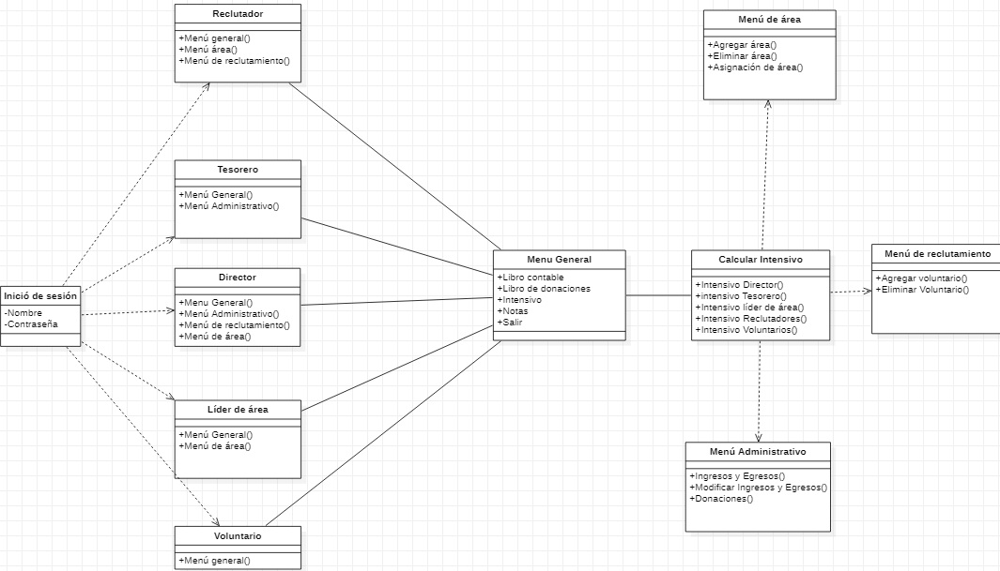

# PIA DE PROGRAMACION ESTRUCTURADA

## Nombre de los integrantes:
- Carlos Daniel Cruz Hernández.		1878902
- Axel Javier Macías Peña. 		1674533
- Luis Antonio Rocha Escobedo		1807769

## Introducción
En una asociación de voluntarios tiene una problemática y el tesorero de dicha asociación desea que los registros como ingresos y egresos sea público para los miembros, ya que tanto como el director y el tesorero quieren que los miembros estén enterados en qué se está gastando los ingresos, así mismo los lideres de área desean asignar las áreas que les tocaría participar a los voluntarios y también han solicitado un método de incentivo para todos los miembros que participan más de cierta hora, con el fin de apoyar a aquellos que se esfuerzan por el voluntariado.

## Pregunta a responder:
¿Qué entidades y funcionalidades realizará la aplicación para proveer un servicio útil?
Entidades:
SUPER CLASE
- Usuario: Esta clase será la super clase ya que todos los miembros de la asociación tendrán que ingresar los datos para poder iniciar sesión.

SUB-CLASES
- Director: Subclase que contiene los siguientes métodos, Menú Principal, Menú Administrativo, Menú de Áreas, Menú de Reclutamiento y Calculo de Incentivo. 
- Tesorero: Subclase que tiene los siguientes métodos: Menú Principal y Menú Administrativo.
- Reclutador: Subclase, sus métodos son: Menú Principal y Menú de Reclutamiento.
- Líder de Área: subclase, con métodos: Menú Principal y Menú de Áreas.
- Voluntario: Igualmente es una Subclase que contiene el siguiente método: Menú Principal.

Atributos:
- Nombre.
- Contraseña.
- Menú Principal:
	- Libro Contable: Registro de ingresos, egresos y fecha de transacción.
	- Libro de Donación: Donaciones.
	- Incentivo: Calculo de Incentivo.
	- Salir: Nos manda al Acceso

- Menú Administrativo:
	- Ingresos y Egresos.
		- Registrar ingreso o egreso
		- Modificar ingreso o egreso
	- Donaciones.
		- Registrar donación
		- Modificar donación

- Menú de Áreas:
	- Agregar Área.
	- Eliminar Área.
	- Asignar Área.

- Menú de Reclutamiento:
	- Voluntario: Nombre, Contraseña y fecha de nacimiento.
		- Registro de voluntario.
		- Eliminar Voluntario.
	
- Cálculo de Incentivo:
	- Incentivo Director.
	- Incentivo Tesorero.
	- Incentivo Reclutador.
	- Incentivo Líder de Área.
	- Incentivo Voluntario.

Funcionalidades:

Manu General:
- Libro Contable: Contiene las transacciones que se realizaron mientras la asociación este activa junto con la fecha de la transacción.
- Libro de Donación: Contiene los nombres de la persona o Empresa y la cantidad que aporto.
- Incentivo: Valida si el miembro de la asociación es aceptado para recibir el incentivo, si lo es se realizará el cálculo y le dará la cantidad para cobrar dicho incentivo, también tendrán la opción de no aceptar el incentivo.
	- Incentivo de Director: Validar si es candidato para el incentivo.
	- Incentivo de Tesorero: Validar si es candidato para el incentivo.
	- Incentivo de Reclutador: Validar si es candidato para el incentivo.
	- Incentivo de Líder de Área: Validar si es candidato para el incentivo.
	- Incentivo de Voluntario: Validar si es candidato para el incentivo.
- Salir.

Menú Administrativo:
- Ingresos y Egresos: Se registrará la fecha y se le pedirá que transacción se realizara o se modificara en caso de una equivocacion.
	- Registrar Ingreso o Egreso
	- Modificar Ingresos y Egresos: Modificara el punto anterior por si llegara a ver errores.
- Donaciones. Se registrará el nombre de la persona o Empresa y la cantidad que aporto.
	- Registrar Donación
	- Modificar Donación.

Menú de Área:
- Agregar Área: Se requiere el número de área.
- Eliminar Área.: Se eliminará un área que se dejó de visitar.
-  Asignar Área: Asignar área a los voluntarios.
- Agregar Voluntario: Se ingresará nombre, fecha de nacimiento y una contraseña para la cuenta.

Menú de Reclutamiento:
- Agregar Voluntario: Se pedirá los datos del voluntario.
-  Eliminar Voluntario: Se ingresará nombre, fecha de nacimiento y una contraseña para eliminar la cuenta.
-  Asignar área: Se asignara.

